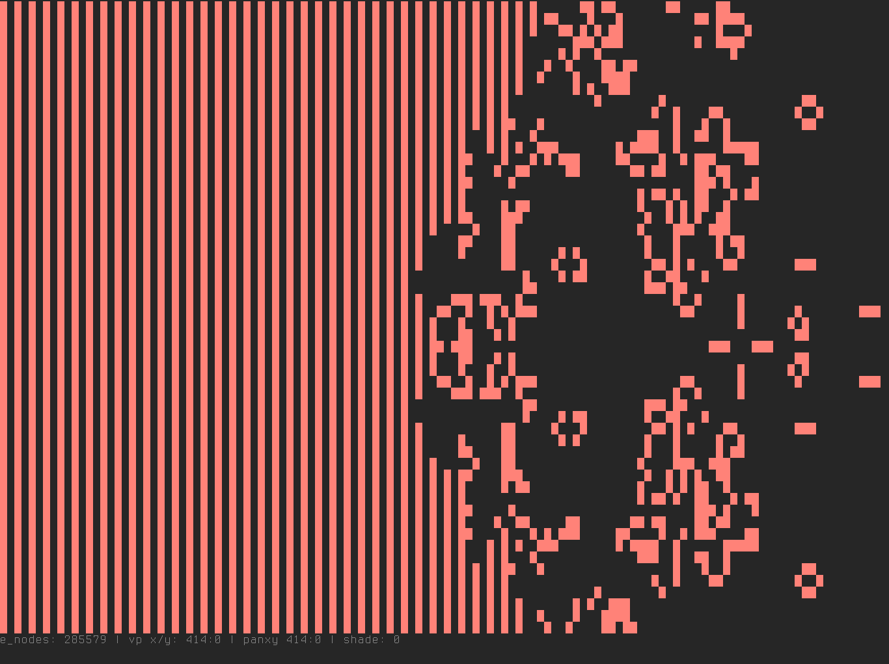

# CGOL :: Ncurses game of life in C

About Game of life: [wikipedia](https://en.wikipedia.org/wiki/Conway%27s_Game_of_Life)

    $ ./cgol 
    CGOL :: Game of life written in C!

    Optional arguments:
        -f SEED_FILE  Set seed file
        -s SPEED_MS   Transition speed, Default=1000
        -S            Set shading
        -r            Set random seed
        -w            Set wrapping edges

## Compile and run
    make
    ./cgol -s 500 -f seeds/koksgalaxy.cells

## Keys

    hjkl    - pan
    HJKL    - pan large steps
    0       - reset pan
    s       - step
    S       - toggle shading
    c       - clear screen
    +/-     - change speed
    <space> - toggle paused
    q       - quit

    Use mouse to draw patterns

## Seed files
Seed files can be found in the *seeds* dir in the repo.  
cgol can read RLE and CELL files by using the `-f` switch.  
